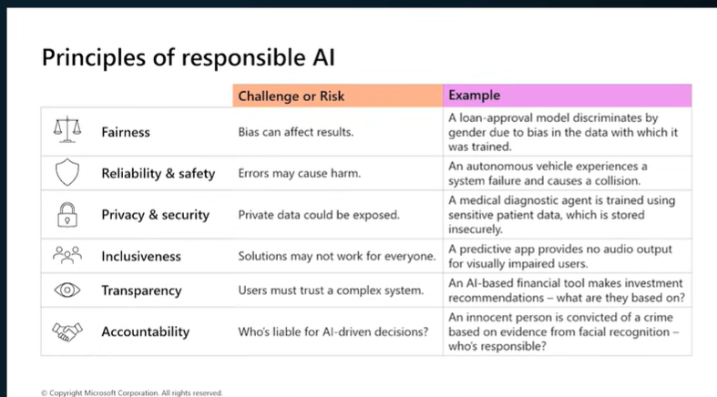

# Responsible AI

Responsible AI is the practice of designing, building, deploying, and monitoring AI systems that are ethical, trustworthy, and aligned with human values.

---

# Why Responsible AI?

AI influences decisions in healthcare, banking, education, hiring, and many other domains. Poorly designed AI systems can introduce bias, privacy risks, and unsafe outcomes.

---

# Microsoft's Six Principles

| Principle | Description |
|------------|-------------|
| Fairness | Prevent bias and discrimination |
| Reliability & Safety | Ensure dependable and safe behavior |
| Privacy & Security | Protect sensitive data |
| Inclusiveness | Design AI for everyone |
| Transparency | Explain AI decisions |
| Accountability | Humans remain responsible |

---

# Fairness

## Definition

AI should treat everyone equally.

## Example

Loan Approval

Training Data

↓

Mostly Male Applicants

↓

Model Learns Bias

↓

Rejects Female Applicants

---

## Best Practices

- Balanced datasets
- Bias testing
- Fairness metrics
- Human review

---

## Interview Question

**Q:** What causes bias?

**Answer**

- Training data
- Labeling errors
- Sampling bias
- Historical bias

---

## AI-102 Notes

Microsoft frequently asks about Responsible AI principles.

Remember:

FRPITA

F → Fairness

R → Reliability

P → Privacy

I → Inclusiveness

T → Transparency

A → Accountability

---

## Summary

Responsible AI helps ensure systems are fair, safe, transparent, and trustworthy.